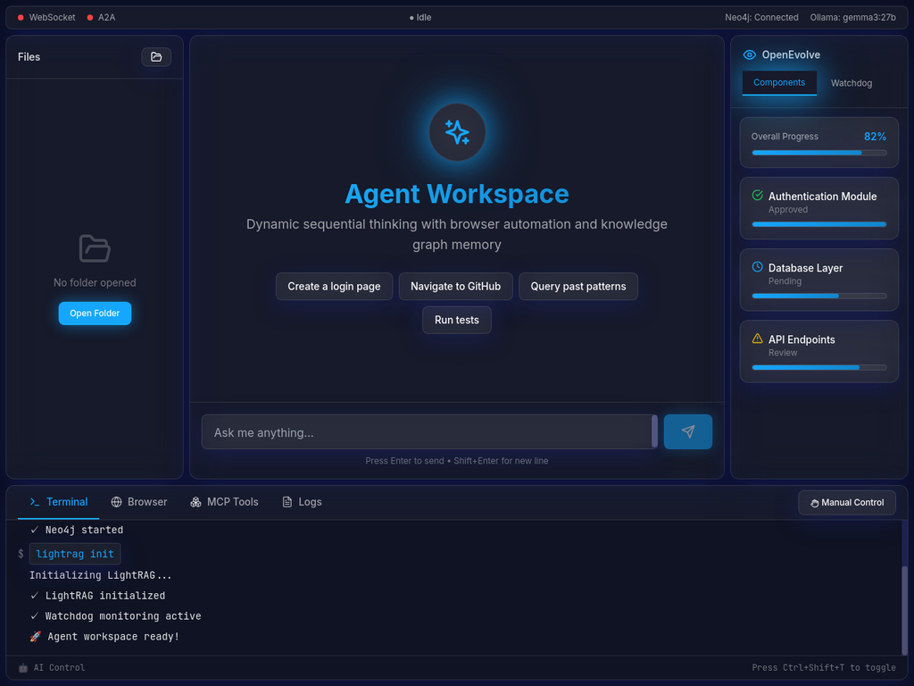

# 🚀 Agentic Self-Evolving Command Center

<div align="center">


**A complete IDE/GUI command center with integrated browser and terminal for self-evolving AI agents**

*Powered by Gemma 3, EvoAgentX, LightRAG, Neo4j, Dynamic MCP, and midnight glassmorphism UI*

[Features](#-features) • [Quick Start](#-quick-start) • [Architecture](#-architecture) • [Documentation](#-documentation)

</div>

---

## 🌟 Overview

The **Agentic Self-Evolving Command Center** is a production-ready AI agent workspace that goes beyond traditional agent frameworks. This is a **complete IDE/GUI command center** with fully integrated browser and terminal control, enabling agents to autonomously code, browse, test, and evolve - all while maintaining a beautiful midnight glassmorphism interface for human oversight and seamless takeover capabilities.

### What Makes This Special?

- 🖥️ **Complete IDE/GUI**: Full-featured command center with integrated browser and terminal - agents can code, browse web, and execute commands autonomously within the interface
- 🔄 **Self-Evolution Focus**: Every component designed for continuous improvement through OpenEvolve watchdog, pattern detection, and EvoAgentX workflow optimization
- 🧠 **Dynamic MCP**: Model Context Protocol with PRAR loop (Perceive-Reason-Act-Reflect) for advanced reasoning, branching decisions, and extensible tool integration
- 👁️ **Human-in-the-Loop**: Takeover mode allows seamless transition between autonomous agent control and manual human intervention in both browser and terminal
- 💾 **Knowledge Graph**: LightRAG + Neo4j automatically mirrors all code, conversations, and executions into a queryable semantic graph for agent learning
- 🎨 **Midnight Glassmorphism**: Production-quality UI with real-time updates, numbered browser overlays (Rango-style), and visual state indicators
- 💬 **Dual Protocol**: WebSocket for real-time streaming chat + JSON-RPC 2.0 for standardized agent-to-agent (A2A) communication
- 📊 **Code Intelligence**: Automatic pattern detection, concept wiring, security analysis, and execution learning from every interaction
---

## 🎨 Preview

<div align="center">



*The complete IDE/GUI command center with midnight glassmorphism design*

</div>

**Visual Highlights:**
- 🌙 Midnight blue gradient background with radial effects
- ✨ Glass panels with 25% opacity and backdrop blur
- 💎 Cyan (#15A7FF) accents for AI-driven elements
- 🎨 Smooth animations and lens flare effects on active tabs
- 📱 Responsive 3-panel layout (File Tree | Chat | OpenEvolve)
- 🖥️ Integrated browser with numbered overlays (Rango-style)
- 💻 Terminal with AI/User command attribution
- 🔌 Real-time connection status indicators

---

## ✨ Features

### 🎨 Frontend

- **Midnight Glassmorphism UI** - Stunning visual design with backdrop blur and cyan accents
- **3-Panel Layout** - File tree (left), chat (center), OpenEvolve (right)
- **Bottom Panel** - Terminal, Browser, MCP Tools, and Logs tabs
- **Real-time Updates** - WebSocket streaming for live agent responses
- **Takeover Mode** - Manual control of browser and terminal
- **Connection Status** - Live indicators for WebSocket and A2A connections

### 🔧 Backend

- **Go Fiber v3** - High-performance web framework
- **Gemma 3 27B** - Powerful LLM via Ollama for reasoning
- **Agent Controller** - Orchestrates all agent activities
- **Browser Manager** - ChromeDP automation with vision analysis
- **Terminal Manager** - PTY support with command execution
- **Memory Systems** - LightRAG (long-term) + ChromeM (short-term)
- **MCP Client** - Model Context Protocol integration
- **Watchdog** - OpenEvolve pattern detection and monitoring

### 🧠 Intelligence

- **Dynamic Thinking** - PRAR loop for advanced reasoning
- **Code Mirroring** - Automatic Neo4j knowledge graph generation
- **EvoX Integration** - Compatible with EvoAgentX self-evolution
- **Concept Wiring** - Semantic relationships in knowledge graph
- **Pattern Detection** - Identifies design patterns and best practices
- **Execution Learning** - Learns from successful and failed actions

### 🔌 Communication

- **WebSocket** - Real-time chat with streaming responses
- **JSON-RPC 2.0** - Agent-to-agent (A2A) protocol
- **REST API** - HTTP endpoints for stateless operations
- **Ollama v1 API** - Chat completions and embeddings

---

## 🏗️ Architecture

```
┌─────────────────────────────────────────────────────────────┐
│                     Frontend (React)                        │
│  ┌──────────┐  ┌──────────┐  ┌──────────────┐             │
│  │File Tree │  │   Chat   │  │  OpenEvolve  │             │
│  └──────────┘  └──────────┘  └──────────────┘             │
│  ┌──────────────────────────────────────────────────────┐  │
│  │  Terminal | Browser | MCP Tools | Logs              │  │
│  └──────────────────────────────────────────────────────┘  │
└────────────────────┬────────────────────────────────────────┘
                     │ WebSocket + JSON-RPC 2.0
                     ↓
┌─────────────────────────────────────────────────────────────┐
│                 Backend (Go Fiber v3)                       │
│  ┌──────────────────────────────────────────────────────┐  │
│  │              Agent Controller                        │  │
│  │  ┌────────────┐  ┌────────────┐  ┌────────────┐    │  │
│  │  │   Gemma    │  │  Planner   │  │  Executor  │    │  │
│  │  └────────────┘  └────────────┘  └────────────┘    │  │
│  └──────────────────────────────────────────────────────┘  │
│  ┌──────────┐  ┌──────────┐  ┌──────────┐  ┌──────────┐  │
│  │ Browser  │  │ Terminal │  │   MCP    │  │ Watchdog │  │
│  │ Manager  │  │ Manager  │  │  Client  │  │          │  │
│  └──────────┘  └──────────┘  └──────────┘  └──────────┘  │
│  ┌──────────────────────────────────────────────────────┐  │
│  │              Memory Systems                          │  │
│  │  ┌────────────────┐  ┌──────────────────────────┐   │  │
│  │  │   LightRAG     │  │  Short-term (ChromeM)   │   │  │
│  │  │  + Neo4j       │  │  Task-based memory      │   │  │
│  │  └────────────────┘  └──────────────────────────┘   │  │
│  └──────────────────────────────────────────────────────┘  │
└─────────────────────────────────────────────────────────────┘
                     │
                     ↓
┌─────────────────────────────────────────────────────────────┐
│         MCP Dynamic Thinking Server (PRAR Loop)             │
│  Perceive → Reason → Act → Reflect                          │
└─────────────────────────────────────────────────────────────┘
                     │
                     ↓
┌─────────────────────────────────────────────────────────────┐
│                  External Services                          │
│  Ollama (gemma3:27b) | Neo4j 5.26 | ChromeDP               │
└─────────────────────────────────────────────────────────────┘
```

---

## 🚀 Quick Start

### Prerequisites

- **Go 1.25+**
- **Node.js 18+**
- **Neo4j 5.26 Community Edition**
- **Ollama** with models:
  - `gemma3:27b`
  - `nomic-embed-text:v1.5`
- **Chrome/Chromium**

### Installation

```bash
# Clone the repository
git clone https://github.com/docpainting/agentic_selfevolve_commandcenter.git
cd agentic_selfevolve_commandcenter

# Configure environment
cp .env.example .env
nano .env  # Add your Neo4j password

# Install frontend dependencies
cd frontend
npm install
cd ..

# Install backend dependencies
cd backend
go mod download
cd ..

# Install MCP server dependencies
cd mcp-dynamic-thinking
go mod download
cd ..
```

### Quick Start Script

```bash
# Start everything at once
./scripts/start-all.sh
```

This will:
- ✅ Check all prerequisites
- ✅ Start Neo4j
- ✅ Verify Ollama models
- ✅ Start backend server (port 8080)
- ✅ Start frontend dev server (port 3000)
- ✅ Start MCP dynamic thinking server

### Manual Start

```bash
# Terminal 1: Start Neo4j
sudo systemctl start neo4j

# Terminal 2: Start backend
cd backend
go run cmd/server/main.go

# Terminal 3: Start frontend
cd frontend
npm run dev

# Terminal 4: Start MCP server (optional)
cd mcp-dynamic-thinking
go run cmd/server/main.go
```

### Access the Application

Open your browser to:
- **Frontend**: http://localhost:3000
- **Backend API**: http://localhost:8080
- **Neo4j Browser**: http://localhost:7474

---

## 📖 Documentation

### Core Documentation

- **[QUICK_SETUP.md](QUICK_SETUP.md)** - Step-by-step installation guide
- **[IMPLEMENTATION_GUIDE.md](IMPLEMENTATION_GUIDE.md)** - Detailed implementation details
- **[COMPLETION_SUMMARY.md](COMPLETION_SUMMARY.md)** - Project overview and status
- **[WEBSOCKET_IMPLEMENTATION.md](WEBSOCKET_IMPLEMENTATION.md)** - WebSocket and Ollama integration

### Specialized Guides

- **[backend/EVOX_INTEGRATION.md](backend/EVOX_INTEGRATION.md)** - EvoAgentX integration guide
- **[backend/scripts/README_CODE_MIRROR.md](backend/scripts/README_CODE_MIRROR.md)** - Neo4j code mirroring
- **[mcp-dynamic-thinking/README.md](mcp-dynamic-thinking/README.md)** - MCP server documentation

### Design Specifications

Located in `docs/`:
- Complete API and protocol specifications
- Design evolution documents
- Architecture diagrams
- Integration patterns

---

## 🎯 Usage Examples

### Basic Agent Interaction

```javascript
// Connect to WebSocket
const ws = new WebSocket('ws://localhost:8080/ws/chat');

// Send command
ws.send(JSON.stringify({
  type: 'user_command',
  payload: { command: 'Find go-light-rag on GitHub' }
}));

// Receive streaming response
ws.onmessage = (event) => {
  const message = JSON.parse(event.data);
  console.log(message.payload.chunk);
};
```

### Agent-to-Agent Communication

```javascript
// Connect to A2A WebSocket
const a2aWs = new WebSocket('ws://localhost:8080/ws/a2a');

// Send JSON-RPC 2.0 request
a2aWs.send(JSON.stringify({
  jsonrpc: '2.0',
  id: '1',
  method: 'agent/getAuthenticatedExtendedCard',
  params: {}
}));
```

### Code Mirroring to Neo4j

```bash
# Mirror your codebase
cd backend/scripts
export NEO4J_PASSWORD="your_password"
go run mirror_code_to_neo4j.go
```

### Query Knowledge Graph

```cypher
// Find all authentication code
MATCH (fn:Function)-[:IMPLEMENTS_CONCEPT]->(con:Concept {name: "Authentication"})
RETURN fn.name, fn.signature, fn.documentation
```

---

## 🎨 UI Features

### Midnight Glassmorphism Theme

- **Background**: Deep midnight blue with radial gradients
- **Glass Panels**: 25% opacity with backdrop blur
- **Accent Color**: Cyan (#15A7FF) for AI-driven elements
- **Animations**: Lens flare effects and smooth transitions
- **Typography**: Inter font family

### Interactive Elements

- **File Tree**: VS Code-style with expandable folders
- **Chat Interface**: Centered input that expands upward
- **Browser Panel**: Numbered overlays for element selection
- **Terminal Panel**: AI/User command attribution with glass bubbles
- **MCP Panel**: Connected servers and activity timeline
- **OpenEvolve Panel**: Component progress and watchdog alerts

---

## 🔧 Configuration

### Environment Variables

```bash
# Backend
NEO4J_URI=bolt://localhost:7687
NEO4J_USERNAME=neo4j
NEO4J_PASSWORD=your_password
OLLAMA_HOST=http://localhost:11434
PORT=8080

# Frontend
VITE_WS_URL=ws://localhost:8080/ws/chat
VITE_A2A_URL=ws://localhost:8080/ws/a2a
VITE_API_URL=http://localhost:8080/api
```

### Ollama Models

```bash
# Install required models
ollama pull gemma3:27b
ollama pull nomic-embed-text:v1.5
```

### Neo4j Setup

```bash
# Install Neo4j 5.26
wget -O - https://debian.neo4j.com/neotechnology.gpg.key | sudo apt-key add -
echo 'deb https://debian.neo4j.com stable latest' | sudo tee /etc/apt/sources.list.d/neo4j.list
sudo apt-get update
sudo apt-get install neo4j=1:5.26.0

# Start Neo4j
sudo systemctl start neo4j
```

---

## 🧪 Testing

### Run Backend Tests

```bash
cd backend
go test ./...
```

### Run Frontend Tests

```bash
cd frontend
npm test
```

### Test WebSocket Connection

```bash
# Install wscat
npm install -g wscat

# Connect to chat
wscat -c ws://localhost:8080/ws/chat

# Send message
{"type":"user_command","payload":{"command":"Hello"}}
```

---

## 📊 Project Status

| Component | Status | Completion |
|-----------|--------|------------|
| Frontend | ✅ Complete | 100% |
| Backend Core | ✅ Complete | 100% |
| Agent Controller | ✅ Complete | 100% |
| Browser Manager | ✅ Complete | 100% |
| Terminal Manager | ✅ Complete | 100% |
| Memory Systems | ✅ Complete | 100% |
| MCP Client | ✅ Complete | 100% |
| Watchdog | ✅ Complete | 100% |
| WebSocket Handlers | ✅ Complete | 100% |
| MCP Dynamic Thinking | ✅ Complete | 100% |
| Neo4j Code Mirroring | ✅ Complete | 100% |
| EvoX Integration | ✅ Complete | 100% |
| Documentation | ✅ Complete | 100% |

**Overall: 100% Production Ready** 🎉

---

## 🛣️ Roadmap

### Phase 1: Core Features (✅ Complete)
- [x] Frontend UI with glassmorphism
- [x] Backend with Fiber v3
- [x] Agent controller with Gemma 3
- [x] Browser and terminal automation
- [x] Memory systems (LightRAG + Neo4j)
- [x] WebSocket communication
- [x] MCP integration

### Phase 2: Advanced Features (✅ Complete)
- [x] MCP Dynamic Thinking Server
- [x] Neo4j code mirroring
- [x] EvoAgentX integration
- [x] Complete documentation

### Phase 3: Enhancements (🚧 Planned)
- [ ] Multi-language code mirroring (Python, JavaScript)
- [ ] Advanced pattern detection algorithms
- [ ] Performance metrics dashboard
- [ ] Plugin system for custom tools
- [ ] Cloud deployment guides
- [ ] Docker containerization
- [ ] CI/CD pipeline

### Phase 4: Community (🚧 Planned)
- [ ] Example workflows
- [ ] Video tutorials
- [ ] Community contributions
- [ ] Plugin marketplace

---

## 🤝 Contributing

We welcome contributions! Please see [CONTRIBUTING.md](CONTRIBUTING.md) for guidelines.

### Development Setup

```bash
# Fork the repository
git clone https://github.com/YOUR_USERNAME/agentic_selfevolve_commandcenter.git

# Create a feature branch
git checkout -b feature/amazing-feature

# Make your changes and commit
git commit -m "Add amazing feature"

# Push to your fork
git push origin feature/amazing-feature

# Open a Pull Request
```

---

## 📄 License

This project is licensed under the MIT License - see the [LICENSE](LICENSE) file for details.

---

## 🙏 Acknowledgements

- **[OpenEvolve](https://github.com/openevolve)** - Self-evolving code framework with watchdog and pattern detection
- **[EvoAgentX](https://github.com/EvoAgentX/EvoAgentX)** - Self-evolving agent framework
- **[LightRAG](https://github.com/MegaGrindStone/go-light-rag)** - Knowledge graph and RAG
- **[Ollama](https://ollama.ai/)** - Local LLM inference
- **[Neo4j](https://neo4j.com/)** - Graph database
- **[Fiber](https://gofiber.io/)** - Go web framework
- **[React](https://react.dev/)** - Frontend framework
- **[Tailwind CSS](https://tailwindcss.com/)** - Styling framework

---

## 📞 Support

- **Issues**: [GitHub Issues](https://github.com/docpainting/agentic_selfevolve_commandcenter/issues)
- **Discussions**: [GitHub Discussions](https://github.com/docpainting/agentic_selfevolve_commandcenter/discussions)
- **Documentation**: See [docs/](docs/) directory

---

## 🌟 Star History

If you find this project useful, please consider giving it a star! ⭐

---

<div align="center">

**Built with ❤️ by the DOC Painting team**

[⬆ Back to Top](#-agentic-self-evolving-command-center)

</div>

